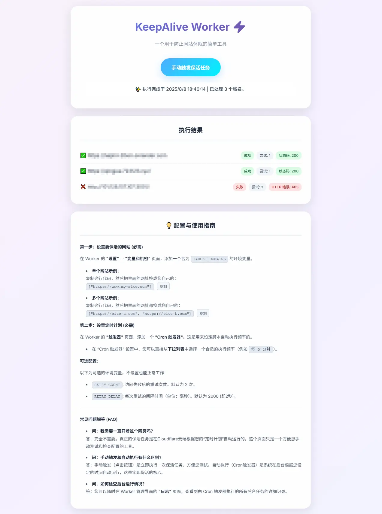
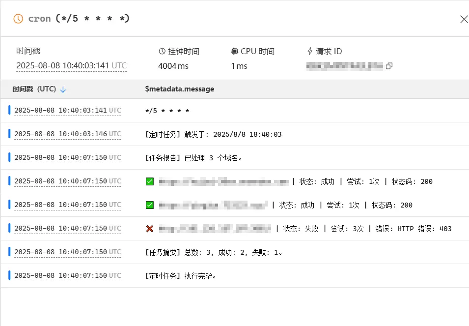

# KeepAlive Worker - 保活脚本

一个部署在 Cloudflare Worker 上的简单脚本，通过定时访问，防止一些免费托管的服务因闲置而休眠。

---

## 用途

许多免费托管平台（如 Render, Vercel, Heroku 等）会在应用长时间无流量时使其进入“休眠”状态。这会导致下次访问响应缓慢，或中断后台任务。

此脚本通过模拟定期访问，保持服务“在线”。

## 功能

*   **定时任务**: 基于 Cron 触发器，按预设频率自动访问目标网站。
*   **失败重试**: 访问失败时，会进行有限次数的重试。
*   **云端配置**: 目标网站、重试次数等均通过 Cloudflare 环境变量管理。
*   **日志查看**: 可在 Cloudflare 后台查看任务执行日志。
*   **手动触发**: 提供一个基础页面，用于部署后快速测试。

## 部署步骤

### 1. 创建 Worker

1.  登录 Cloudflare 仪表板。
2.  进入 **计算 (Workers)** -> **Workers 和 Pages**。
3.  点击 **创建应用程序 (Create application)**，选择从 **Hello World!** 开始。
4.  为 Worker 命名，然后点击 **部署 (Deploy)**。

### 2. 粘贴代码

1.  创建成功后，点击 **编辑代码 (Edit code)**。
2.  删除编辑器中的默认代码。
3.  复制 [`src/worker.js`](src/worker.js:1) 的全部内容，粘贴到编辑器中。
4.  点击 **部署 (Deploy)**。

### 3. 设置环境变量

1.  返回 Worker 的管理页面，进入 **设置 (Settings)** -> **变量和机密 (Variables and Secrets)**。
2.  在 **环境变量 (Environment Variables)** 下，添加以下内容：

| 变量名 | 是否必需 | 描述 | 示例 |
| :--- | :---: | :--- | :--- |
| `TARGET_DOMAINS` | **是** | 要保活的网站 URL 列表 (JSON 数组格式)。 | `["https://site1.com", "https://site2.com"]` |
| `RETRY_COUNT` | 否 | 失败后的重试次数 (默认为 `2`)。 | `3` |
| `RETRY_DELAY` | 否 | 每次重试的间隔时间，单位毫秒 (默认为 `2000`)。 | `3000` |

3.  添加完变量后，点击 **部署 (Deploy)** 保存。

### 4. 设置定时触发器

1.  在 Worker 的管理页面，进入 **触发器 (Triggers)**。
2.  在 **Cron 触发器 (Cron Triggers)** 下，添加一个新的触发器。
3.  选择一个合适的执行频率（例如 `每 5 分钟`）。
4.  保存触发器。

部署完成。脚本将根据设置的频率自动运行。

## 查看效果

*   **查看日志**: 在 Worker 的 **日志 (Logs)** 页面，可以查看到每次定时任务的执行记录。
*   **手动测试**: 访问 Worker URL (例如 `https://your-worker-name.your-subdomain.workers.dev`)，可以手动触发一次任务。

**测试页面预览:**

**Cloudflare 后台日志:**
